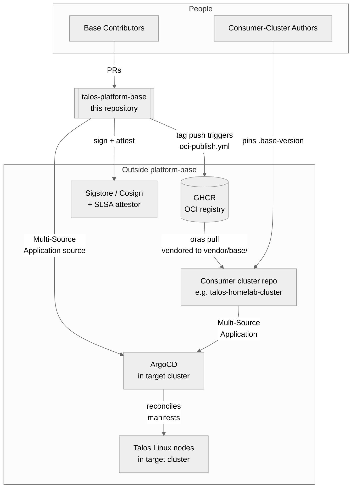
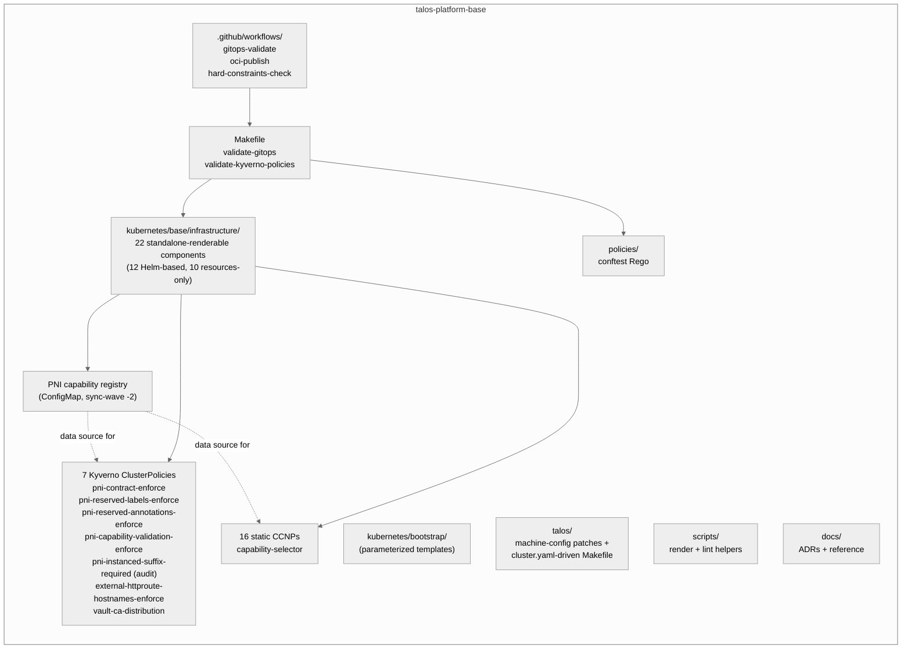
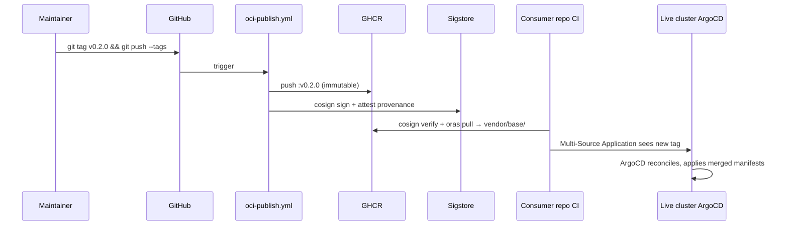
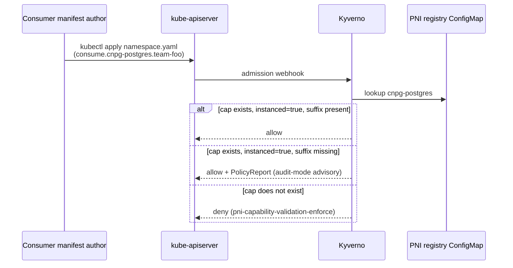

# Architecture

This document is the [C4-model][c4] **System Context** (Level 1) and
**Container** (Level 2) view of `talos-platform-base`. For
component-level (L3) detail of the capability-first network surface, see
[`docs/capability-architecture.md`](docs/capability-architecture.md);
for individual decisions, see the [ADR set](docs/) (`adr-*.md`).

[c4]: https://c4model.com/

> **Reading order:** READ THIS FIRST if you are new. Then dive into
> ADRs for decisions, the cookbook for recipes, the capability
> reference for the catalogue.

## L1 — System Context



### Roles

- **Base contributors** push code, version tags trigger OCI publish.
- **GHCR** stores the immutable OCI artifact (`ghcr.io/<owner>/talos-platform-base:<tag>`).
- **Sigstore / cosign** sign each artifact keyless via GitHub OIDC; SLSA build provenance is attached.
- **Consumer-cluster authors** maintain a separate repo that pins a `.base-version`, vendors via `oras pull`, and overlays cluster-specific values.
- **ArgoCD** runs in the target cluster and reconciles a Multi-Source Application that references *both* repos.
- **Talos Linux nodes** receive machine-config and Kubernetes workloads.

## L2 — Container View (base internals)



### Subsystems

| Subsystem | Purpose | Key files |
|---|---|---|
| `kubernetes/base/infrastructure/` | 22 cluster-agnostic Helm-base components, each renderable in isolation | `<comp>/{application,kustomization,namespace,values}.yaml` |
| `kubernetes/bootstrap/` | parameterized ArgoCD + Cilium bootstrap templates (envsubst) | `argocd/*.tmpl`, `cilium/extras.yaml` |
| Platform Network Interface (PNI) | capability-first contract — registry, admission policies, CCNPs | `kubernetes/base/infrastructure/platform-network-interface/` |
| `talos/` | machine-config patches + multi-cluster generation Makefile | `patches/*`, `cluster.yaml.tmpl` |
| `policies/` | conftest Rego — capability sunset, label hygiene | `policies/conftest/*` |
| Validation pipeline | kustomize render + conftest + kubeconform + Kyverno-CLI | `scripts/`, `Makefile`, `.github/workflows/gitops-validate.yml` |
| OCI publish | cosign keyless + SLSA attestation + immutable GHCR tag | `.github/workflows/oci-publish.yml` |

## Key flows

### Tagged release → consumer cluster



See [`docs/oci-artifact-verification.md`](docs/oci-artifact-verification.md)
for the verification recipe.

### Capability admission



## Sync-wave order

```text
-2  PNI registry ConfigMap         (admitted before policies)
-1  ArgoCD AppProjects             (RBAC boundary)
 0  Infrastructure components      (cert-manager, kyverno, …)
 1  Apps (workload-layer)
```

## What this is NOT

- Not a runnable cluster — no node IPs, no SOPS secrets, no OIDC issuers.
- Not a library/SDK — no API users.
- Not an end-user product — the audience is operators and contributors.

Those concerns live in:

- **Consumer cluster repos** for cluster identity, secrets, overlays.
- **Application repos** for workload manifests.

## See also

- [`docs/README.md`](docs/README.md) — full documentation index (Diátaxis-organised)
- [`docs/capability-architecture.md`](docs/capability-architecture.md) — L3 detail on PNI capabilities
- [`AGENTS.md`](AGENTS.md) — tool-agnostic SOT (canonical for agents)
