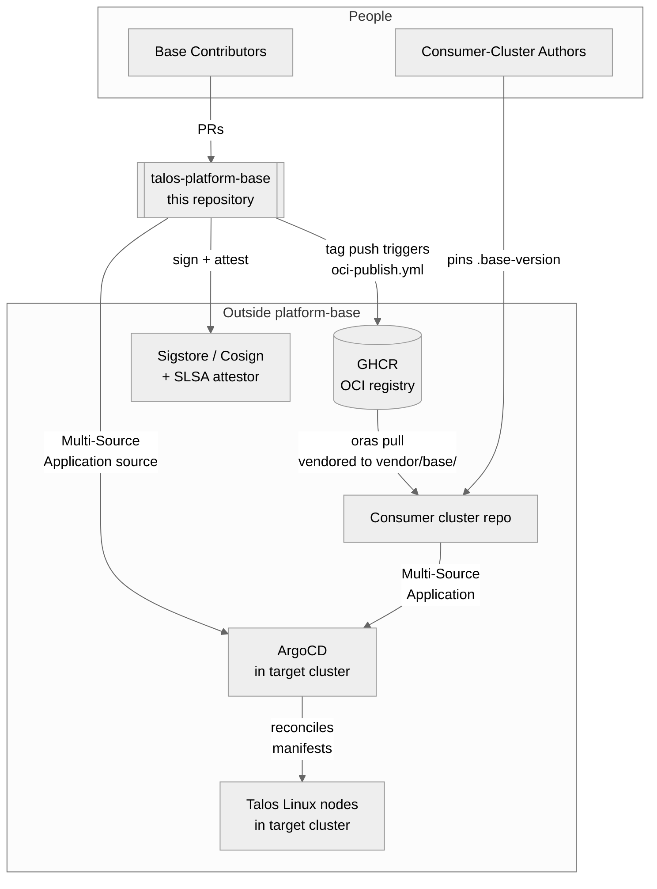
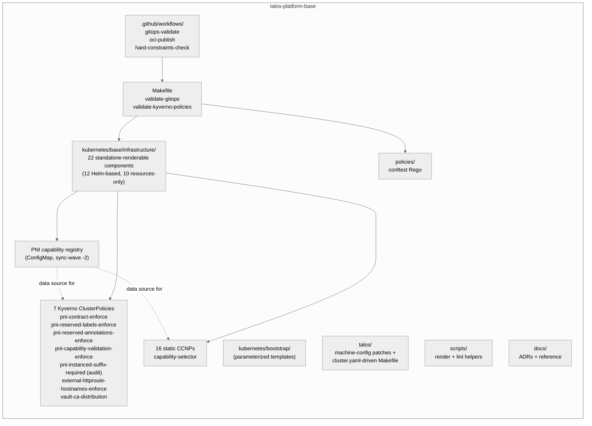
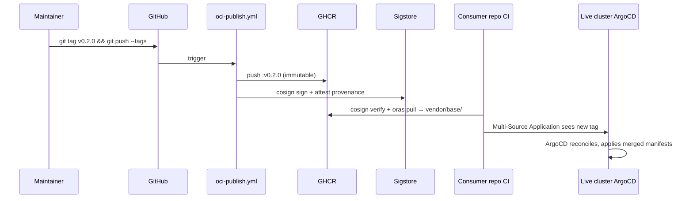
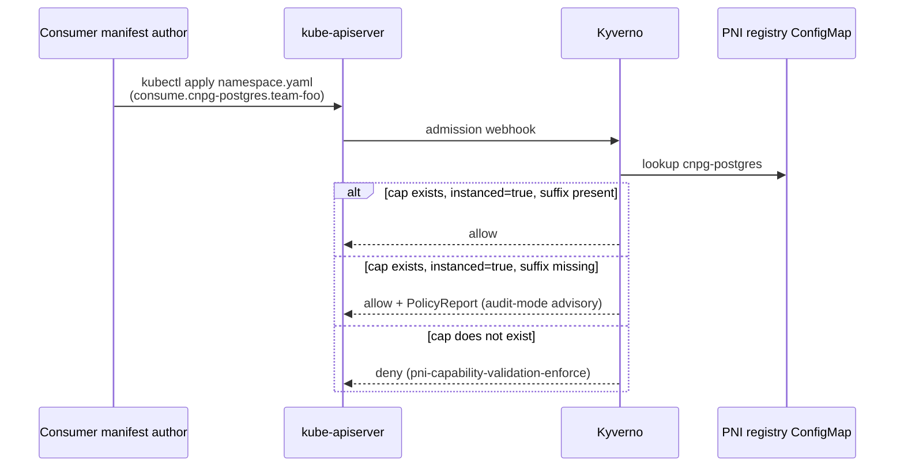

# Architecture

This document is a hybrid **[C4][c4]** and **[arc42][arc42]** architecture
description:

- arc42 sections 1 (Introduction & Goals), 2 (Architecture Constraints),
  4 (Solution Strategy), 10 (Quality Requirements), 11 (Risks & Technical
  Debt), 12 (Glossary) — for the narrative scaffolding arc42 is strong at.
- C4 levels 1 (System Context) and 2 (Container) — for the structural
  diagrams C4 is strong at.

arc42 sections 5 (Building Block View) and 6 (Runtime View) are covered
by the C4 L2 and "Key flows" sections respectively; section 9
(Architecture Decisions) is covered by the [ADR set](docs/) (`adr-*.md`)
under MADR 3.0 frontmatter. For L3 component detail of the capability-first
network surface, read
[`docs/capability-architecture.md`](docs/capability-architecture.md).

[c4]: https://c4model.com/
[arc42]: https://arc42.org/

> **Reading order:** READ THIS FIRST if you are new. Then dive into
> ADRs for decisions, the cookbook for recipes, the capability
> reference for the catalogue.

## 1. Introduction and Goals

`talos-platform-base` is the cluster-agnostic GitOps base of the
Talos-on-Kubernetes deployment family. Its job is to ship a versioned,
signed, attested OCI artifact that one or more consumer cluster repos
vendor and overlay with cluster-specific identity.

**Goals (in priority order):**

1. **Reusable across clusters.** A second cluster pins a tag and is
   bootstrappable without any base-repo edits.
2. **Supply-chain auditable.** Every artifact is signed (cosign keyless
   OIDC), provenance-attested (SLSA), and inventory-attested
   (CycloneDX 1.6 SBOM). Reproducible from `chart.lock.yaml` +
   `values.yaml`.
3. **Capability-first network contract.** Tools are swappable
   implementations of stable capabilities (see
   [`docs/capability-architecture.md`](docs/capability-architecture.md)).
4. **No cluster identity inside.** No IPs, FQDNs, OIDC issuers, SOPS
   keys, or per-cluster secrets — those live in the consumer cluster
   repo.

**Audience:** platform operators and contributors maintaining one or
more Talos/Kubernetes clusters. NOT application developers; NOT
end-users; NOT marketing readers.

## 2. Architecture Constraints

The non-negotiable invariants. These are enforced by CI gates and
documented in [`AGENTS.md`](AGENTS.md) §"Hard Constraints" and
§"Tool-Agnostic Safety Invariants":

| Constraint | Why | Enforced by |
|---|---|---|
| No SecureBoot | `metal-installer-secureboot` causes Talos boot loops | `AGENTS.md` + reviewer-flagged at PR |
| No `debugfs=off` | causes "failed to create root filesystem" Talos boot loop | `AGENTS.md` |
| Gateway API only — no `kind: Ingress` | API-deprecated; consistent L7 model | `hard-constraints-check.yml` (CI required) |
| EndpointSlices only — no `kind: Endpoints` | deprecated since Kubernetes v1.33 | `hard-constraints-check.yml` (CI required) |
| Capability-selector CCNPs only | tool swap = label move, not CCNP rewrite | reviewer + `AGENTS.md` |
| Namespace-anchored producer trust | no central tool-signature whitelist | Kyverno `pni-reserved-labels-enforce` |
| Apache-2.0, REUSE 3.3 compliant | OSS hygiene + SBOM correctness | `reuse-compliance` CI job |

## 3. System scope — see L1 below

The arc42 §3 "System Scope and Context" maps directly onto the C4 L1
**System Context** view below — no duplication.

## 4. Solution Strategy

How the goals listed in §1 are achieved at the highest abstraction
level. Four architectural decisions do the load-bearing work; each is
captured in a separate ADR with MADR 3.0 frontmatter:

| Strategy | Realised by | ADR |
|---|---|---|
| **Goal 1** (reusable) — separate cluster identity from platform code | Three-role split: base / harness-plugin / consumer-cluster | [`adr-multi-repo-platform-split.md`](docs/adr-multi-repo-platform-split.md) |
| **Goal 2** (auditable) — every artifact carries cryptographic provenance | OCI artifact + cosign + SLSA + CycloneDX SBOM, all keyless OIDC | [`SECURITY.md`](SECURITY.md) §"Supply chain" + [`docs/oci-artifact-verification.md`](docs/oci-artifact-verification.md) |
| **Goal 3** (capability-first) — tools are swappable behind a stable contract | PNI v2 with namespace-anchored producer trust, capability-first CCNP selectors | [`adr-capability-producer-consumer-symmetry.md`](docs/adr-capability-producer-consumer-symmetry.md) |
| **Goal 4** (no cluster identity) — base is fully cluster-agnostic | Rendered manifests pattern + consumer-side overlays own namespace creation | [`adr-namespace-ownership-rendered-manifests.md`](docs/adr-namespace-ownership-rendered-manifests.md) |

A fifth ADR
([`adr-two-layer-capability-architecture.md`](docs/adr-two-layer-capability-architecture.md))
defines the separation between Layer A (Tool-Capability-Index, the
platform-wide catalogue) and Layer B (PNI network-trust registry, the
runtime contract). Both consume the same capability identifiers; only
Layer B drives Kyverno + Cilium.

## L1 — System Context


```mermaid
%%{init: { "theme": "neutral" } }%%
flowchart TB
  subgraph Authors["People"]
    BC[Base Contributors]
    CC[Consumer-Cluster Authors]
  end

  subgraph Outside["Outside platform-base"]
    GHCR[(GHCR<br/>OCI registry)]
    SBX[Sigstore / Cosign<br/>+ SLSA attestor]
    ArgoCD[ArgoCD<br/>in target cluster]
    Talos[Talos Linux nodes<br/>in target cluster]
    Cons[Consumer cluster repo]
  end

  Base[[talos-platform-base<br/>this repository]]

  BC -->|PRs| Base
  Base -->|"tag push triggers<br/>oci-publish.yml"| GHCR
  Base -->|sign + attest| SBX
  GHCR -->|"oras pull<br/>vendored to vendor/base/"| Cons
  CC -->|"pins .base-version"| Cons
  Cons -->|"Multi-Source<br/>Application"| ArgoCD
  Base -->|"Multi-Source<br/>Application source"| ArgoCD
  ArgoCD -->|"reconciles<br/>manifests"| Talos
```

### Roles

- **Base contributors** push code, version tags trigger OCI publish.
- **GHCR** stores the immutable OCI artifact (`ghcr.io/<owner>/talos-platform-base:<tag>`).
- **Sigstore / cosign** sign each artifact keyless via GitHub OIDC; SLSA build provenance is attached.
- **Consumer-cluster authors** maintain a separate repo that pins a `.base-version`, vendors via `oras pull`, and overlays cluster-specific values.
- **ArgoCD** runs in the target cluster and reconciles a Multi-Source Application that references *both* repos.
- **Talos Linux nodes** receive machine-config and Kubernetes workloads.

## L2 — Container View (base internals)


```mermaid
%%{init: { "theme": "neutral" } }%%
flowchart LR
  subgraph Base["talos-platform-base"]
    direction TB
    Make[Makefile<br/>validate-gitops<br/>validate-kyverno-policies]
    Boot["kubernetes/bootstrap/<br/>(parameterized templates)"]
    Infra["kubernetes/base/infrastructure/<br/>22 standalone-renderable components<br/>(12 Helm-based, 10 resources-only)"]
    Talos["talos/<br/>machine-config patches +<br/>cluster.yaml-driven Makefile"]
    Pol["policies/<br/>conftest Rego"]
    Scripts["scripts/<br/>render + lint helpers"]
    Docs["docs/<br/>ADRs + reference"]
    CI[".github/workflows/<br/>gitops-validate<br/>oci-publish<br/>hard-constraints-check"]
    Reg["PNI capability registry<br/>(ConfigMap, sync-wave -2)"]
    Pol2["7 Kyverno ClusterPolicies<br/>pni-contract-enforce<br/>pni-reserved-labels-enforce<br/>pni-reserved-annotations-enforce<br/>pni-capability-validation-enforce<br/>pni-instanced-suffix-required (audit)<br/>external-httproute-hostnames-enforce<br/>vault-ca-distribution"]
    CCNP["16 static CCNPs<br/>capability-selector"]

    Reg -.->|"data source for"| Pol2
    Reg -.->|"data source for"| CCNP
    Infra ---> Reg
    Infra ---> Pol2
    Infra ---> CCNP
    Make --> Pol
    Make --> Infra
    CI --> Make
  end
```

### Subsystems

| Subsystem | Purpose | Key files |
|---|---|---|
| `kubernetes/base/infrastructure/` | 22 cluster-agnostic Helm-base components, each renderable in isolation | `<comp>/{application,kustomization,namespace,values}.yaml` |
| `kubernetes/bootstrap/` | parameterized ArgoCD + Cilium bootstrap templates (envsubst) | `argocd/*.tmpl`, `cilium/extras.yaml` |
| Platform Network Interface (PNI) | capability-first contract — registry, admission policies, CCNPs | `kubernetes/base/infrastructure/platform-network-interface/` |
| `talos/` | machine-config patches + multi-cluster generation Makefile | `patches/*`, `cluster.yaml.tmpl` |
| `policies/` | conftest Rego — capability sunset, label hygiene | `policies/conftest/*` |
| Validation pipeline | kustomize render + conftest + kubeconform + Kyverno-CLI | `scripts/`, `Makefile`, `.github/workflows/gitops-validate.yml` |
| OCI publish | cosign keyless + SLSA attestation + immutable GHCR tag | `.github/workflows/oci-publish.yml` |

## Key flows

### Tagged release → consumer cluster


```mermaid
sequenceDiagram
  participant Maintainer
  participant GitHub
  participant CI as oci-publish.yml
  participant GHCR
  participant Sigstore
  participant Consumer as Consumer repo CI
  participant Cluster as Live cluster ArgoCD

  Maintainer->>GitHub: git tag v0.2.0 && git push --tags
  GitHub->>CI: trigger
  CI->>GHCR: push :v0.2.0 (immutable)
  CI->>Sigstore: cosign sign + attest provenance
  Consumer->>GHCR: cosign verify + oras pull → vendor/base/
  Consumer->>Cluster: Multi-Source Application sees new tag
  Cluster->>Cluster: ArgoCD reconciles, applies merged manifests
```

See [`docs/oci-artifact-verification.md`](docs/oci-artifact-verification.md)
for the verification recipe.

### Capability admission


```mermaid
sequenceDiagram
  participant Author as Consumer manifest author
  participant K8s as kube-apiserver
  participant Kyverno
  participant Reg as PNI registry ConfigMap

  Author->>K8s: kubectl apply namespace.yaml<br/>(consume.cnpg-postgres.team-foo)
  K8s->>Kyverno: admission webhook
  Kyverno->>Reg: lookup cnpg-postgres
  alt cap exists, instanced=true, suffix present
    Kyverno-->>K8s: allow
  else cap exists, instanced=true, suffix missing
    Kyverno-->>K8s: allow + PolicyReport (audit-mode advisory)
  else cap does not exist
    Kyverno-->>K8s: deny (pni-capability-validation-enforce)
  end
```

## Sync-wave order

```text
-2  PNI registry ConfigMap         (admitted before policies)
-1  ArgoCD AppProjects             (RBAC boundary)
 0  Infrastructure components      (cert-manager, kyverno, …)
 1  Apps (workload-layer)
```

## What this is NOT

- Not a runnable cluster — no node IPs, no SOPS secrets, no OIDC issuers.
- Not a library/SDK — no API users.
- Not an end-user product — the audience is operators and contributors.

Those concerns live in:

- **Consumer cluster repos** for cluster identity, secrets, overlays.
- **Application repos** for workload manifests.

## 10. Quality Requirements

The non-functional qualities the architecture optimises for. Each is
backed by a load-bearing mechanism in the repo today.

| Quality | Target | Mechanism |
|---|---|---|
| **Supply-chain integrity** | Every release verifiable to commit SHA via OIDC chain | cosign + SLSA + CycloneDX 1.6 SBOM in [`docs/oci-artifact-verification.md`](docs/oci-artifact-verification.md) |
| **Reproducibility** | `chart.lock.yaml` + `values.yaml` → identical rendered output | `verify-rendered.sh` (CI required); idempotent renderer |
| **Cluster-agnostic** | A second cluster pins a tag and bootstraps without base edits | `make day0` flow in consumer repo; `.base-version` pin; no IPs/FQDNs in base |
| **Capability-stable swappability** | Tool swap (for example Prometheus → Victoria-Metrics) = label move, not CCNP rewrite | Capability-first CCNP selectors; namespace-anchored trust |
| **CI-required gates** | No broken main; no silent regression | conftest (864+954 tests), kubeconform, kyverno-cli, REUSE lint, hard-constraints-check, capability-index validation |
| **Multi-maintainer-ready** | New contributor can land a non-trivial change in ≤ 4 h human time | `CONTRIBUTING.md`, `MAINTAINERS.md`, per-component READMEs, MADR ADR template |
| **Operator-facing docs** | Audience is platform operators, not end-users — content is at operator altitude | Diátaxis-organised `docs/`; arc42 §1 explicitly excludes end-user audience |

## 11. Risks and Technical Debt

Honest accounting of where the architecture is fragile or in flight.
Each item is either tracked or has a documented mitigation; do not let
this list grow silently.

| Risk / debt | Severity | Mitigation / tracking |
|---|---|---|
| **Pre-release tags v0.2–v0.4 exist without GitHub Releases.** Consumers pinning to them get the OCI artifact but no human-readable changelog. | low | Documented in [`UPGRADING.md`](UPGRADING.md) §"Note on prior git tags"; v0.5.0 is the first canonical release |
| **OpenSSF Best Practices Badge not yet enrolled.** Self-assessment lives at [`docs/openssf-best-practices.md`](docs/openssf-best-practices.md); external enrolment is a manual step. | low | Will be addressed in a follow-up by the maintainer; badge appears in README only once project ID is assigned |
| **Multi-cluster reuse exercised against only one consumer (`talos-homelab-cluster`).** Second-consumer validation is desk-only. | medium | Issue #32 tracks an E2E Multi-Source demo against a second test cluster |
| **`pni-instanced-suffix-required` is audit-mode only.** A tenant that omits the instance suffix on an instanced capability gets a `PolicyReport` advisory, not an admission deny. | medium | Documented in [`docs/capability-architecture.md`](docs/capability-architecture.md) §"Enforcement summary"; flip to enforce-mode tracked under capability v2 follow-ups |
| **Single maintainer.** Bus factor = 1; review coverage on changes is human + automated gates, not multi-reviewer. | medium | OpenSSF Scorecard `Code-Review` check will score low by design; mitigated by aggressive CI gating and adversarial reviewer subagent dispatch on risky diffs |
| **Two further PNI policies still need the v0.5.0-style name/behaviour cleanup.** | low | Closed by #48 — done |
| **`kubernetes/base/` tree duplicated in consumer repo (homelab) is a Phase-1.5 migration leftover.** | low | Tracked consumer-side; not a base-repo concern |
| **Vale prose linter not yet configured.** Style consistency relies on individual contributor judgement. | low | Tracked in the docs-standards adoption sweep (#56) |

## 12. Glossary

The cross-domain vocabulary used in this document lives in
[`docs/glossary.md`](docs/glossary.md) (per Diátaxis "Reference"
quadrant). AGENTS.md §"Key Terms" carries the curated subset
auto-loaded into agent contexts.

## See also

- [`docs/README.md`](docs/README.md) — full documentation index (Diátaxis-organised)
- [`docs/capability-architecture.md`](docs/capability-architecture.md) — L3 detail on PNI capabilities
- [`AGENTS.md`](AGENTS.md) — tool-agnostic SOT (canonical for agents)
- [`docs/openssf-best-practices.md`](docs/openssf-best-practices.md) — self-assessment against OpenSSF Passing-level criteria
