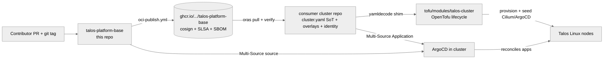

# talos-platform-base

[](https://api.reuse.software/info/github.com/Nosmoht/talos-platform-base)
[](https://scorecard.dev/viewer/?uri=github.com/Nosmoht/talos-platform-base)

> Build the same Talos + Kubernetes substrate across many clusters from
> one signed, provenance-attested base — Talos, Cilium, and ArgoCD stood
> up the same way every time.

## Why this exists

Two problems recur in homelab-to-fleet Kubernetes operation:

- **Per-cluster drift.** Each new cluster begins as a copy-paste of the
  last one. Six months later, no two clusters render the same manifests
  and no one remembers why.
- **Vendor-the-tarball trust.** Most platform "templates" are git
  submodules or `wget`-ed tarballs. There is nothing to verify and
  no proof who built what.

This base is the answer to those two problems, in order.

The base provisions **Talos plus its three co-equal substrate pillars
— Talos + Cilium + ArgoCD** — through one OpenTofu module
(`tofu/modules/talos-cluster`), the sole cluster-lifecycle path. The
module disables the Talos-default Flannel and seeds Cilium (CNI) and
ArgoCD as Talos `inlineManifest`s at bootstrap; everything above the
substrate is GitOps-reconciled. See
[`docs/day-zero-pattern.md`](docs/day-zero-pattern.md) for the layered
bring-up and the documented bootstrap exceptions.

## The idea

| Pain | Answer | Mechanism |
|---|---|---|
| Per-cluster drift | A single immutable artifact, vendored per cluster | OCI artifact on `ghcr.io`, pinned by `.base-version` |
| Tarball trust | Every artifact carries cryptographic provenance | cosign keyless signature + SLSA build provenance + CycloneDX 1.6 SBOM |

The base is **substrate-only**: it ships Talos + Cilium + ArgoCD (plus
`cert-approver` boot glue) and nothing above them. The OpenTofu module
stands the substrate up identically on every cluster, and the signed OCI
artifact gives consumers a verifiable thing to vendor instead of an
unaudited tarball. Everything that is *not* substrate — monitoring,
secrets, storage, the network-trust contract — lives in the separate
[`talos-platform-apps`](https://github.com/devobagmbh/talos-platform-apps)
catalog as independently versioned, signed OCI components that consumers
self-serve. See
[`docs/adr-substrate-only-base.md`](docs/adr-substrate-only-base.md) for
the boundary.

## At a glance



Full system context and container view: [`ARCHITECTURE.md`](ARCHITECTURE.md)
(C4 L1 + L2 with arc42 narrative).

## What ships in the artifact

A consumer that pulls `ghcr.io/<owner>/talos-platform-base:<tag>`
receives a frozen tree containing:

- **The OpenTofu cluster-lifecycle module** (`tofu/modules/talos-cluster`)
  — the sole Talos provisioning path: per-class Image-Factory installer,
  machine-config generation, config apply, bootstrap, kubeconfig, plus the
  create-only Cilium (CNI) and ArgoCD `inlineManifest` seeds. Ships its
  `helm/` values floor (`cilium-values.yaml`, `argocd-values.yaml`) and a
  worked `examples/homelab` `yamldecode` shim.
- **`cluster.yaml.example`** — the declarative cluster Source-of-Truth
  template (identity, Talos/Kubernetes versions, endpoint, pod/service
  CIDR, dual-stack, node classes, machine-config patches, substrate
  config). `task cluster:init-yaml` copies it to a `cluster.yaml` the
  consumer fills in.
- **The substrate-only infrastructure components** under
  `kubernetes/base/infrastructure/` — `argocd/` and `cert-approver/`,
  the only components delivered as base kustomize manifests. ArgoCD is a
  co-equal substrate pillar; `cert-approver` is Talos boot-necessity glue
  (no CSR auto-approval → no bootable cluster). Every non-substrate
  component (monitoring, secrets, storage, device plugins, the
  network-trust contract, …) now lives in the separate
  [`talos-platform-apps`](https://github.com/devobagmbh/talos-platform-apps)
  catalog as independently versioned, signed OCI artifacts; consumers
  self-serve from there (see
  [`docs/adr-substrate-only-base.md`](docs/adr-substrate-only-base.md)).
- **Per-class Talos machine-config**, derived by the module from the
  `cluster.yaml` classes (architecture, system extensions, optional
  ARM/SBC overlay, per-class and per-node patches) — `cni:none` is forced
  in both the config-generation and per-node apply passes so a caller
  patch cannot resurrect Flannel.
- **Parameterised ArgoCD bootstrap templates** (`*.tmpl`, rendered by
  the consumer at install time via `task bootstrap:argocd`).
- **The validation pipeline** itself (`task gitops:validate`, conftest
  Rego, kubeconform, the Layer-C hardware-features linter) so consumers
  can re-render the base inside their own CI and catch divergence.

What does **not** ship: cluster identity (IPs, FQDNs, OIDC issuers,
SOPS keys), per-cluster secrets, live ArgoCD state, application
manifests. Those live in the consumer cluster repo.

## Consume

Day-0 — vendor, define, and provision a consumer cluster:

```bash
TAG=v1.0.0

# 1. Verify before pulling — see "Verify" section below for the full
#    end-to-end signature, provenance, and SBOM check.
cosign verify \
  --certificate-identity-regexp \
    "^https://github.com/Nosmoht/talos-platform-base/\\.github/workflows/oci-publish\\.yml@refs/tags/v[0-9]+\\.[0-9]+\\.[0-9]+$" \
  --certificate-oidc-issuer 'https://token.actions.githubusercontent.com' \
  ghcr.io/Nosmoht/talos-platform-base:${TAG}

# 2. Pull into the consumer repo's gitignored vendor tree.
oras pull ghcr.io/Nosmoht/talos-platform-base:${TAG} --output vendor/base/

# 3. Create the declarative cluster Source-of-Truth and fill it in
#    (identity, versions, endpoint, CIDRs, node classes, substrate).
task cluster:init-yaml          # cluster.yaml.example -> cluster.yaml
$EDITOR cluster.yaml
```

The consumer's OpenTofu root is a thin `yamldecode` shim over
`cluster.yaml` that maps it onto the `tofu/modules/talos-cluster` typed
interface (worked example:
`tofu/modules/talos-cluster/examples/homelab/`). `tofu apply` provisions
Talos, installs Cilium as the CNI, and seeds ArgoCD (namespace + app +
CRDs). The remaining step is wiring ArgoCD to your cluster repo via the
root App-of-Apps — see
[`docs/day-zero-pattern.md`](docs/day-zero-pattern.md) for the bootstrap
detail. (`task bootstrap:argocd` only seeds the consumer-identity
App-of-Apps root — the root AppProject + Application — after waiting on
the module-seeded ArgoCD CRDs + server; the former Helm-based
`argocd-install` step is gone, because the module already delivers ArgoCD.) Secrets
(`sops_age_key`, `cilium_ipsec_key`) are supplied via `TF_VAR_*`/env,
never via `cluster.yaml`.

Day-2 — reference both repos from a single ArgoCD Application:

```yaml
apiVersion: argoproj.io/v1alpha1
kind: Application
spec:
  sources:
    - repoURL: https://github.com/Nosmoht/talos-platform-base.git
      targetRevision: v1.0.0
      ref: base
    - repoURL: https://github.com/<owner>/<consumer-cluster-repo>.git
      targetRevision: main
      path: kubernetes/overlays/<cluster>/<component>/
      helm:
        valueFiles:
          - $base/kubernetes/base/infrastructure/<component>/values.yaml
          - values-<cluster>.yaml
```

A worked walk-through (30 minutes, end-to-end):
[`docs/tutorial-first-consumer-cluster.md`](docs/tutorial-first-consumer-cluster.md).
The deeper rationale for the two-mechanism split:
[`docs/adr-multi-repo-platform-split.md`](docs/adr-multi-repo-platform-split.md).

## Verify

Every tagged artifact has three independent attestations, all anchored
to the GitHub OIDC token identity of `.github/workflows/oci-publish.yml`:

| Attestation | Tool | Question it answers |
|---|---|---|
| **Signature** | cosign keyless | Was this built by the official workflow? |
| **Build provenance** | SLSA v1 (`actions/attest-build-provenance`) | What commit, runner, and inputs produced it? |
| **Software bill of materials** | CycloneDX 1.6 (Syft) | What files and licences are inside? |

The full five-step verification recipe (signature → digest →
provenance → SBOM → checksums) is in
[`docs/oci-artifact-verification.md`](docs/oci-artifact-verification.md).
Consumers are expected to run all five steps in their own CI before any
vendored base reaches a live cluster. Failure of any step is fail-closed:
do not vendor.

## Honest status

- **One maintainer** ([@nosmoht](https://github.com/nosmoht)).
  Single-bus-factor — mitigated by aggressive CI gating and
  adversarial-reviewer dispatch, not by multi-maintainer review.
- **`v1.0.0` released** (2026-06-06); `v0.5.0` was the first GitHub
  Release. Post-1.0 SemVer now applies in full: a breaking change to
  base Helm values or to the `cluster.yaml` / `talos-cluster` module
  interface requires a MAJOR bump.
- **First consumer exists** ([`talos-homelab-cluster`](https://github.com/Nosmoht/talos-homelab-cluster));
  second-consumer validation is desk-only at the moment
  (issue [#32](https://github.com/Nosmoht/talos-platform-base/issues/32)).
- **Known risks and technical debt** are listed in
  [`ARCHITECTURE.md §11`](ARCHITECTURE.md#11-risks-and-technical-debt).
  Read that before adopting the base in a regulated environment.
- **OpenSSF Best Practices Badge** is self-assessed in
  [`docs/openssf-best-practices.md`](docs/openssf-best-practices.md);
  external enrolment is pending.

The audience for this repo is platform operators evaluating or adopting
the base, not application developers or end-users.

## Documentation

| Read this | If you want to |
|---|---|
| [`ARCHITECTURE.md`](ARCHITECTURE.md) | Understand the system (C4 L1+L2 with arc42 §1, 2, 4, 10, 11, 12) |
| [`docs/adr-substrate-only-base.md`](docs/adr-substrate-only-base.md) | Understand the substrate / apps-catalog boundary |
| [`docs/tutorial-first-consumer-cluster.md`](docs/tutorial-first-consumer-cluster.md) | Bootstrap a second cluster from scratch |
| [`docs/oci-artifact-verification.md`](docs/oci-artifact-verification.md) | Verify a release before vendoring |
| [`UPGRADING.md`](UPGRADING.md) | Apply a version bump |
| [`CHANGELOG.md`](CHANGELOG.md) | Read per-release notes |
| [`SECURITY.md`](SECURITY.md) | Report a vulnerability |
| [`CONTRIBUTING.md`](CONTRIBUTING.md) | Open a PR |
| [`AGENTS.md`](AGENTS.md) | Configure an agentic tool against the repo |

Full Diátaxis index: [`docs/README.md`](docs/README.md).

## Contributing

PRs that touch a single component and pass `task gitops:validate` are
reviewable in one round. The full contribution workflow (Conventional
Commits, the issue-readiness gate, the CI required-check list) lives in
[`CONTRIBUTING.md`](CONTRIBUTING.md).

## Community and support

GitHub Discussions and Issues at
[`Nosmoht/talos-platform-base`](https://github.com/Nosmoht/talos-platform-base).
Single-maintainer cadence: best-effort response, no SLA.

## Security

Vulnerability reports go to the address in [`SECURITY.md`](SECURITY.md)
or via the [machine-readable
`security.txt`](.well-known/security.txt) (RFC 9116). Acknowledgement
within 5 business days; supply-chain details and the threat model live
in `SECURITY.md`, not here.

## License

[Apache-2.0](LICENSE). The repo is [REUSE
3.3](https://reuse.software/spec/) compliant; per-file licence metadata
is in `REUSE.toml` and the canonical text in `LICENSES/`.
