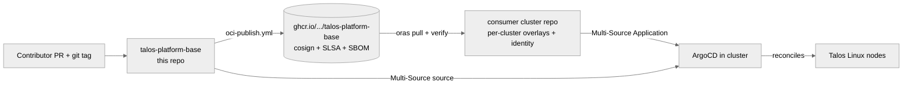

# talos-platform-base

[](https://api.reuse.software/info/github.com/Nosmoht/talos-platform-base)
[](https://scorecard.dev/viewer/?uri=github.com/Nosmoht/talos-platform-base)

> Build the same Kubernetes platform across many Talos clusters from one
> signed, provenance-attested base — and swap any tool inside it without
> rewriting your network policies.

## Why this exists

Three problems recur in homelab-to-fleet Kubernetes operation:

- **Per-cluster drift.** Each new cluster begins as a copy-paste of the
  last one. Six months later, no two clusters render the same manifests
  and no one remembers why.
- **Tool lock-in via network policy.** A `CiliumNetworkPolicy` that
  matches on `app.kubernetes.io/name: prometheus` makes
  Prometheus → Victoria-Metrics a multi-day rewrite, not a label move.
- **Vendor-the-tarball trust.** Most platform "templates" are git
  submodules or `wget`-ed tarballs. There is nothing to verify and
  no proof who built what.

This base is the answer to those three problems, in order.

The base ships **Talos plus the minimum** needed for ArgoCD to take
over; everything else is GitOps-reconciled. See
[`docs/day-zero-pattern.md`](docs/day-zero-pattern.md) for the three
layers and the documented bootstrap exceptions.

## The idea

| Pain | Answer | Mechanism |
|---|---|---|
| Per-cluster drift | A single immutable artifact, vendored per cluster | OCI artifact on `ghcr.io`, pinned by `.base-version` |
| Tool lock-in | Network policies select **capabilities**, not tool names | Platform Network Interface (PNI) v2 — namespace-anchored producer trust |
| Tarball trust | Every artifact carries cryptographic provenance | cosign keyless signature + SLSA build provenance + CycloneDX 1.6 SBOM |

The capability-first model is the differentiator. A consumer namespace
opts in with `platform.io/consume.monitoring-scrape: "true"`; the
Cilium policy admitting its egress selects on
`capability-provider.monitoring-scrape`, not on the provider's name.
Swap Prometheus for Victoria-Metrics by moving one pod label. Trust is
namespace-local: a pod is believed to provide a capability only if its
namespace declares the matching `provide.<cap>`. No central trust list
to grow stale.

See [`docs/capability-architecture.md`](docs/capability-architecture.md)
for the full explanation;
[`docs/pni-cookbook.md`](docs/pni-cookbook.md) for the recipes.

## At a glance



Full system context and container view: [`ARCHITECTURE.md`](ARCHITECTURE.md)
(C4 L1 + L2 with arc42 narrative).

## What ships in the artifact

A consumer that pulls `ghcr.io/<owner>/talos-platform-base:<tag>`
receives a frozen tree containing:

- **22 standalone-renderable infrastructure components** under
  `kubernetes/base/infrastructure/`. 15 are Helm-based (chart + values
  pinned via `chart.lock.yaml`, rendered manifests committed alongside);
  7 ship plain Kubernetes resources (`cert-approver`, `kubevirt`,
  `kubevirt-cdi`, `local-path-provisioner`, `multus-cni`,
  `piraeus-operator`, `platform-network-interface`).
- **Platform Network Interface (PNI)** Kyverno policies and Cilium
  cluster-wide network policies that enforce the capability contract.
- **Talos machine-config patches** (common, control-plane without
  `extraManifests`, DRBD, worker variants for GPU / gVisor / KubeVirt /
  Raspberry-Pi).
- **Parameterised ArgoCD bootstrap templates** (`*.tmpl`, rendered by
  the consumer at install time).
- **The validation pipeline** itself (`make validate-gitops`, conftest
  Rego, kubeconform, kyverno-cli, capability-index linter) so consumers
  can re-render the base inside their own CI and catch divergence.

What does **not** ship: cluster identity (IPs, FQDNs, OIDC issuers,
SOPS keys), per-cluster secrets, live ArgoCD state, application
manifests. Those live in the consumer cluster repo.

## Consume

Day-0 — vendor the base into a consumer cluster repo:

```bash
TAG=v0.5.0
OWNER=<your-github-owner>   # owner of the consumer repo

# 1. Verify before pulling — see "Verify" section below for the full
#    end-to-end signature, provenance, and SBOM check.
cosign verify \
  --certificate-identity-regexp \
    "^https://github.com/Nosmoht/talos-platform-base/\\.github/workflows/oci-publish\\.yml@refs/tags/v[0-9]+\\.[0-9]+\\.[0-9]+$" \
  --certificate-oidc-issuer 'https://token.actions.githubusercontent.com' \
  ghcr.io/Nosmoht/talos-platform-base:${TAG}

# 2. Pull into the consumer repo's gitignored vendor tree.
oras pull ghcr.io/Nosmoht/talos-platform-base:${TAG} --output vendor/base/
```

Day-2 — reference both repos from a single ArgoCD Application:

```yaml
apiVersion: argoproj.io/v1alpha1
kind: Application
spec:
  sources:
    - repoURL: https://github.com/Nosmoht/talos-platform-base.git
      targetRevision: v0.5.0
      ref: base
    - repoURL: https://github.com/<owner>/<consumer-cluster-repo>.git
      targetRevision: main
      path: kubernetes/overlays/<cluster>/<component>/
      helm:
        valueFiles:
          - $base/kubernetes/base/infrastructure/<component>/values.yaml
          - values-<cluster>.yaml
```

A worked walk-through (30 minutes, end-to-end):
[`docs/tutorial-first-consumer-cluster.md`](docs/tutorial-first-consumer-cluster.md).
The deeper rationale for the two-mechanism split:
[`docs/adr-multi-repo-platform-split.md`](docs/adr-multi-repo-platform-split.md).

## Verify

Every tagged artifact has three independent attestations, all anchored
to the GitHub OIDC token identity of `.github/workflows/oci-publish.yml`:

| Attestation | Tool | Question it answers |
|---|---|---|
| **Signature** | cosign keyless | Was this built by the official workflow? |
| **Build provenance** | SLSA v1 (`actions/attest-build-provenance`) | What commit, runner, and inputs produced it? |
| **Software bill of materials** | CycloneDX 1.6 (Syft) | What files and licences are inside? |

The full five-step verification recipe (signature → digest →
provenance → SBOM → checksums) is in
[`docs/oci-artifact-verification.md`](docs/oci-artifact-verification.md).
Consumers are expected to run all five steps in their own CI before any
vendored base reaches a live cluster. Failure of any step is fail-closed:
do not vendor.

## Honest status

- **One maintainer** ([@nosmoht](https://github.com/nosmoht)).
  Single-bus-factor — mitigated by aggressive CI gating and
  adversarial-reviewer dispatch, not by multi-maintainer review.
- **Pre-1.0.** `v0.5.0` is the first GitHub Release; SemVer applies but
  breaking changes are allowed in MINOR bumps per SemVer §4.
- **First consumer exists** ([`talos-homelab-cluster`](https://github.com/Nosmoht/talos-homelab-cluster));
  second-consumer validation is desk-only at the moment
  (issue [#32](https://github.com/Nosmoht/talos-platform-base/issues/32)).
- **Known risks and technical debt** are listed in
  [`ARCHITECTURE.md §11`](ARCHITECTURE.md#11-risks-and-technical-debt).
  Read that before adopting the base in a regulated environment.
- **OpenSSF Best Practices Badge** is self-assessed in
  [`docs/openssf-best-practices.md`](docs/openssf-best-practices.md);
  external enrolment is pending.

The audience for this repo is platform operators evaluating or adopting
the base, not application developers or end-users.

## Documentation

| Read this | If you want to |
|---|---|
| [`ARCHITECTURE.md`](ARCHITECTURE.md) | Understand the system (C4 L1+L2 with arc42 §1, 2, 4, 10, 11, 12) |
| [`docs/capability-architecture.md`](docs/capability-architecture.md) | Understand the capability-first network contract |
| [`docs/pni-cookbook.md`](docs/pni-cookbook.md) | Write a consumer or producer manifest |
| [`docs/tutorial-first-consumer-cluster.md`](docs/tutorial-first-consumer-cluster.md) | Bootstrap a second cluster from scratch |
| [`docs/oci-artifact-verification.md`](docs/oci-artifact-verification.md) | Verify a release before vendoring |
| [`UPGRADING.md`](UPGRADING.md) | Apply a version bump |
| [`CHANGELOG.md`](CHANGELOG.md) | Read per-release notes |
| [`SECURITY.md`](SECURITY.md) | Report a vulnerability |
| [`CONTRIBUTING.md`](CONTRIBUTING.md) | Open a PR |
| [`AGENTS.md`](AGENTS.md) | Configure an agentic tool against the repo |

Full Diátaxis index: [`docs/README.md`](docs/README.md).

## Contributing

PRs that touch a single component and pass `make validate-gitops` plus
`make validate-kyverno-policies` are reviewable in one round. The full
contribution workflow (Conventional Commits, the issue-readiness gate,
the CI required-check list) lives in
[`CONTRIBUTING.md`](CONTRIBUTING.md).

## Community and support

GitHub Discussions and Issues at
[`Nosmoht/talos-platform-base`](https://github.com/Nosmoht/talos-platform-base).
Single-maintainer cadence: best-effort response, no SLA.

## Security

Vulnerability reports go to the address in [`SECURITY.md`](SECURITY.md)
or via the [machine-readable
`security.txt`](.well-known/security.txt) (RFC 9116). Acknowledgement
within 5 business days; supply-chain details and the threat model live
in `SECURITY.md`, not here.

## License

[Apache-2.0](LICENSE). The repo is [REUSE
3.3](https://reuse.software/spec/) compliant; per-file licence metadata
is in `REUSE.toml` and the canonical text in `LICENSES/`.
