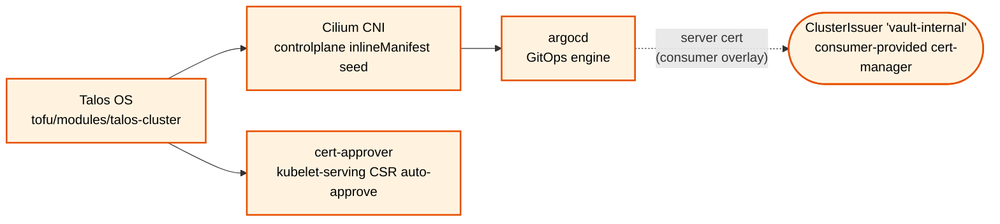

# Component Dependencies

Human-maintained dependency map for the components in
`kubernetes/base/infrastructure/`. **No render script enforces this
file** — see the maintenance note at the bottom.

Since the v2.0.0 substrate-only ablation
([`adr-substrate-only-base.md`](adr-substrate-only-base.md)) this directory
ships exactly two components — `argocd` + `cert-approver` — so the base-internal
dependency graph is now trivial. The dependency map for the 20 non-substrate
components (vault, cert-manager, monitoring, storage, GPU, virt, …) moved with
those components to the [`talos-platform-apps`](https://github.com/devobagmbh/talos-platform-apps)
catalog; consult the catalog repo for their inter-component edges.

## Scope

Hard edges (solid, labeled) are sourced from one of:

- A service-DNS reference in a `values.yaml`.
- A `ClusterIssuer`/`Issuer` name in a `values.yaml`.
- A CRD producer ↔ CR consumer relationship inside the base.

Soft edges (dotted) are sourced from one of:

- ADR-documented namespace co-tenancy
  ([`adr-namespace-ownership-rendered-manifests.md`](adr-namespace-ownership-rendered-manifests.md)).
- App-of-Apps deploy provenance (ArgoCD → everything).
- Hard-constraint or substrate prerequisites (Talos → Cilium → ArgoCD).

Network-policy `provide.<cap>` / `consume.<cap>` labels (the dissolved
capability-network contract, now an apps-CI Conftest + consumer-Kyverno
concern, not base-resident) are **not** a source for this graph — they are
an admission-time policy contract, not a component-dependency declaration.

## The graph

## Edge sources

| Edge | Source | File / line |
|---|---|---|
| `talos → cilium → argocd` | substrate boot order | `kubernetes/bootstrap/` README + tutorial step sequence; Cilium is a controlplane `inlineManifest` seed (`tofu/modules/talos-cluster`) |
| `talos → cert-approver` | substrate boot necessity | no auto-approval → no kubelet serving certs → no bootable cluster |
| `argocd ⇢ ClusterIssuer 'vault-internal'` | `ClusterIssuer` reference (consumer-provided) | `kubernetes/base/infrastructure/argocd/values.yaml:8-11` (`group: cert-manager.io`, `kind: ClusterIssuer`, `name: vault-internal`). cert-manager + Vault are no longer base-resident; the issuer is supplied by the consumer cluster / apps catalog |

The `argocd ⇢ vault-internal` edge is the one cross-component reference that
survives in the substrate: `argocd`'s server-certificate block
(`server.certificate.enabled: true` in `argocd/values.yaml`) renders a
`cert-manager.io/v1` `Certificate` referencing the `vault-internal`
`ClusterIssuer`. After the ablation, cert-manager and Vault live in the apps
catalog, so this is a **consumer-overlay** dependency, not a base-internal one.

> **Substrate-only sync caveat.** Because `argocd`'s rendered manifest emits a
> `cert-manager.io/v1 Certificate`, a cluster that syncs the substrate `argocd`
> component *before* installing cert-manager (CRDs) and providing the
> `vault-internal` `ClusterIssuer` from the apps catalog will hit a
> missing-CRD / missing-issuer error and ArgoCD will not reach its TLS steady
> state. Either source cert-manager + the issuer alongside the substrate, or
> override `server.certificate.enabled: false` in a consumer values overlay.

## What this graph does NOT show

- **Non-substrate component dependencies.** The 20 components removed at
  v2.0.0 — and their inter-component service-DNS / CRD edges — live in the
  [`talos-platform-apps`](https://github.com/devobagmbh/talos-platform-apps)
  catalog. This file maps only the substrate.
- **Consumer-overlay dependencies.** When a consumer cluster repo vendors the
  base and adds its own manifests (e.g. a Vault `VaultServer` CR, a CNPG
  `Cluster`), those CRs use CRDs shipped by the apps catalog. The base ships
  the **substrate**; the consumer composes the rest. Consumer-side edges are
  out of scope.
- **Runtime/operational dependencies.** Pod-to-pod L4 reachability is
  enforced by network policy; deploy order is governed by ArgoCD sync waves.
  This graph is a build-time / design-time map, not a runtime topology.
- **`platform.io/provide.<cap>` / `consume.<cap>` labels.** The
  capability-network contract dissolved out of the base (now apps-CI
  Conftest + consumer-side Kyverno). These labels describe an
  admission-policy contract for tenant traffic, not a
  component-dependency tree, and are deliberately not the source for
  this graph.

## Maintenance

This file is hand-maintained. When you submit a PR that:

- adds a new component under `kubernetes/base/infrastructure/`, OR
- removes a component, OR
- renames a component directory, OR
- changes a service-DNS cross-reference in a `values.yaml`, OR
- changes a `ClusterIssuer` / cross-component CR reference,

…edit this file in the same PR. PR reviewers flag stale graphs.

A future render-script-based approach was considered and rejected: at
the current (substrate-only) component count with a single documented
cross-reference, CNCF Platforms White Paper TVP guidance — "thinnest
viable platform layer, validate user demand before tooling investment" —
argues for the manual approach until the cross-reference count or the
consultation frequency grows materially. Re-evaluate when either crosses ~50.
