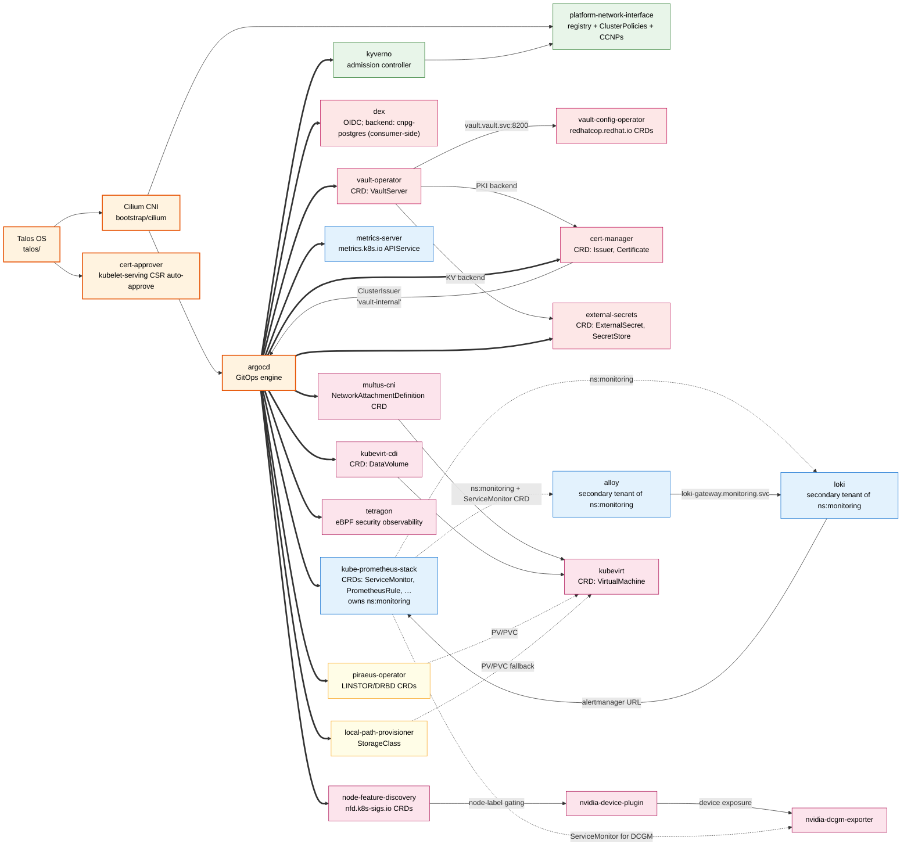

# Component Dependencies

Human-maintained dependency map for the components in
`kubernetes/base/infrastructure/`. **No render script enforces this
file** — see the maintenance note at the bottom.

## Scope

Hard edges (solid, labeled) are sourced from one of:

- A service-DNS reference in a `values.yaml` (e.g.
  `vault.vault.svc.cluster.local:8200`).
- A `ClusterIssuer`/`Issuer` name in a `values.yaml`.
- A CRD producer ↔ CR consumer relationship inside the base.

Soft edges (dotted) are sourced from one of:

- ADR-documented namespace co-tenancy
  ([`adr-namespace-ownership-rendered-manifests.md`](adr-namespace-ownership-rendered-manifests.md)).
- App-of-Apps deploy provenance (ArgoCD → everything).
- Hard-constraint or substrate prerequisites (Talos → Cilium → ArgoCD).

PNI `provide.<cap>` / `consume.<cap>` labels are **not** a source for
this graph — the labels are an admission-time policy contract, not a
component-dependency declaration, and are incomplete across components
that don't ship a `namespace.yaml`.

## The graph

## Edge sources

| Edge | Source | File / line |
|---|---|---|
| `talos → cilium → argocd` | bootstrap order | `kubernetes/bootstrap/` README + tutorial step sequence |
| `argocd → *` | App-of-Apps deploy provenance | `kubernetes/bootstrap/argocd/root-application.yaml.tmpl` |
| `argocd → cert-manager` | `ClusterIssuer` reference | `kubernetes/base/infrastructure/argocd/values.yaml:8-11` (`group: cert-manager.io`, `kind: ClusterIssuer`, `name: vault-internal`) |
| `cert-manager → argocd` | same block as above | Issuer name `vault-internal` (Vault-issued) |
| `vault-operator → vault-config-operator` | service DNS in chart values | `kubernetes/base/infrastructure/vault-config-operator/values.yaml`: `https://vault.vault.svc.cluster.local:8200` |
| `alloy → loki` | service DNS in chart values | `kubernetes/base/infrastructure/alloy/values.yaml`: `url = "http://loki-gateway.monitoring.svc/loki/api/v1/push"` |
| `loki → kube-prometheus-stack` | service DNS in chart values | `kubernetes/base/infrastructure/loki/values.yaml`: `alertmanager_url: …monitoring.svc:9093` |
| `kube-prometheus-stack → {alloy, loki}` (ns co-tenancy) | namespace-ownership ADR | [`adr-namespace-ownership-rendered-manifests.md`](adr-namespace-ownership-rendered-manifests.md) + `kubernetes/base/infrastructure/alloy/kustomization.yaml` header comment |
| `pni → {kyverno, cilium}` | Layer-B contract | `ARCHITECTURE.md §"L2 Container View"`, `docs/glossary.md` ("Kyverno + Cilium contract") |
| CRD-producer edges (NFD → nvdp → DCGM, multus → kvirt, cdi → kvirt, …) | rendered CRD manifests | each component's `_rendered/crds.yaml` or rendered manifest |

## What this graph does NOT show

- **Consumer-overlay dependencies.** When a consumer cluster repo
  vendors the base and adds its own manifests (e.g. a Vault
  `VaultServer` CR, a CNPG `Cluster`), those CRs use the CRDs shipped
  here. The base ships the **vocabulary**; the consumer ships the
  **instances**. Consumer-side edges are out of scope.
- **Runtime/operational dependencies.** Pod-to-pod L4 reachability is
  enforced by CCNPs; deploy order is governed by ArgoCD sync waves.
  This graph is a build-time / design-time map, not a runtime topology.
- **`platform.io/provide.<cap>` / `consume.<cap>` labels.** These
  exist on `namespace.yaml` of *some* components and not others. They
  describe an admission-policy contract for tenant traffic, not a
  component-dependency tree. They are deliberately not the source for
  this graph.

## Maintenance

This file is hand-maintained. When you submit a PR that:

- adds a new component under `kubernetes/base/infrastructure/`, OR
- removes a component, OR
- renames a component directory, OR
- changes a service-DNS cross-reference in a `values.yaml`, OR
- changes a `ClusterIssuer` / cross-component CR reference,

…edit this file in the same PR. PR reviewers flag stale graphs.

A future render-script-based approach was considered and rejected:
the catalog (`docs/platform-capability-index.yaml`) is the right
SOT for **capability-level** dependency, but at 22 components with
3 documented service-endpoint cross-references, CNCF Platforms
White Paper TVP guidance — "thinnest viable platform layer,
validate user demand before tooling investment" — argues for the
manual approach until the cross-reference count or the consultation
frequency grows materially. Re-evaluate when either crosses ~50.
