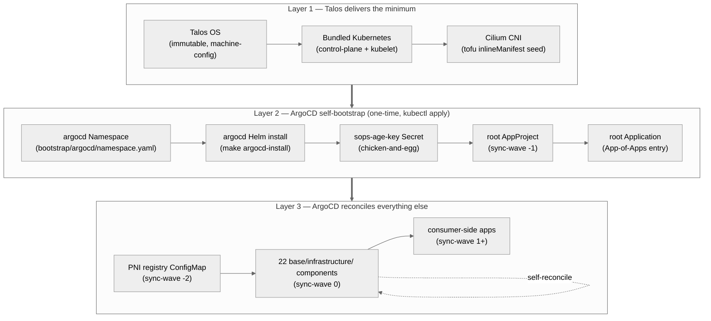

# Day-Zero Pattern — Three Layers from Bare Metal to ArgoCD-Reconciled

**Audience:** consumer-cluster operators, contributors, agentic tools.
**Companion docs:** [tutorial](tutorial-first-consumer-cluster.md) ·
[`ARCHITECTURE.md`](../ARCHITECTURE.md) ·
[`component-dependencies.md`](component-dependencies.md).

This explains *how* a consumer cluster goes from "bare nodes" to
"every component reconciled by ArgoCD", and *why* the path has three
distinct layers. The same path is recapped as commands in the
[*Where to go next*](tutorial-first-consumer-cluster.md#where-to-go-next)
section of the tutorial.

## The design intent in one sentence

> `talos-platform-base` provisions **Talos plus its substrate floor —
> Cilium (CNI) and ArgoCD** — through the `tofu/modules/talos-cluster`
> module, so that everything above the substrate can be reconciled by
> ArgoCD.

That sentence is the load-bearing invariant. The substrate pillars
(Talos + Cilium + ArgoCD) are seeded by the OpenTofu module at bootstrap
as Talos `inlineManifests`; every other artifact in this repo sits in
exactly one of the three layers below, and the layer dictates whether it
may be `kubectl apply`-ed directly or must be reconciled by ArgoCD.

## The three layers



Each layer has a distinct **lifecycle owner** and a distinct **change
mechanism**:

| Layer | Lifecycle owner | Change mechanism | Reconciliation |
|---|---|---|---|
| 1 — Talos + bundled K8s + CNI | Talos / Sidero Labs | `talosctl apply-config` + `talosctl upgrade-k8s` | none in-cluster |
| 2 — ArgoCD self-bootstrap | this repo's `Makefile` | `make argocd-bootstrap` (one-time) | none until Layer 3 |
| 3 — everything else | this repo's `kubernetes/base/infrastructure/` + consumer overlay | git commit + push | ArgoCD continuous reconciliation |

## Layer 1 — what Talos delivers

Talos ships an immutable Linux node image with a bundled Kubernetes
control plane. Two artifacts in this repo participate in Layer 1:

1. **Talos machine-config patches** (the consumer's `tofu/modules/talos-cluster`
   call — `config_patches` plus per-node `config_patches`, including the ones
   the module composes from each node's `image` + `hardware_capabilities`). These
   define kubelet args, kernel cmdline, install disk, and similar host-level
   inputs. They never touch Kubernetes resources directly.

2. **Cilium CNI seed** (delivered by the `tofu/modules/talos-cluster`
   call). When `deploy_cilium = true` (the default) the module renders the
   Cilium chart locally with `data.helm_template` and bakes it into the
   controlplane `cluster.inlineManifests` as a create-only bootstrap **seed**
   — the same `data.helm_template` → inlineManifest pattern as the ArgoCD
   seed. It also injects `cluster.network.cni.name: none` +
   `cluster.proxy.disabled: true`, so the Talos-default Flannel and kube-proxy
   never come up. The module's `helm/cilium-values.yaml` is the floor;
   per-cluster install-time config rides the typed `cilium_*` inputs +
   `cilium_values_override`. Talos applies the seed at K8s-bootstrap time —
   **not** via ArgoCD. The reason is causal: without a CNI no pod can start,
   including ArgoCD's own pods. (`kubernetes/bootstrap/cilium/{values,extras}.yaml`
   are retained as the reference for optional Day-2 Cilium self-management; the
   former `cluster.extraManifests`-URL render path —
   `scripts/render-cilium-bootstrap.sh` — is retired.)

Cilium is **deliberately not present** in
`kubernetes/base/infrastructure/`. Looking for it there is a category
error; it lives in `bootstrap/` precisely because it must exist
before ArgoCD can run.

## Layer 2 — ArgoCD self-bootstrap

ArgoCD cannot reconcile itself before it exists. The bootstrap break
of GitOps purity is contained to exactly five `kubectl apply` /
`helm` invocations, all documented as exceptions in
[`AGENTS.md`](../AGENTS.md) §"Hard Constraints":

```bash
# Three invocations triggered by `make argocd-install`:
kubectl apply -f kubernetes/bootstrap/argocd/namespace.yaml
helm upgrade --install argocd argo/argo-cd \
  --version '<pinned>' \
  --namespace argocd \
  -f kubernetes/base/infrastructure/argocd/values.yaml
kubectl create secret generic sops-age-key \
  --namespace argocd \
  --from-file=keys.txt=$SOPS_AGE_KEY_FILE \
  --dry-run=client -o yaml | kubectl apply -f -

# Two invocations triggered by `make argocd-bootstrap`:
kubectl apply -f kubernetes/bootstrap/argocd/_out/root-project.yaml
kubectl apply -f kubernetes/bootstrap/argocd/_out/root-application.yaml
```

Each exception has a documented reason:

- **`namespace.yaml`** — ArgoCD must exist somewhere before it can
  reconcile its own namespace.
- **`helm install argocd`** — the same pod cannot install itself.
  Re-runs of `make argocd-install` are idempotent (`helm upgrade
  --install`) and ArgoCD's own `Application` for itself
  (`base/infrastructure/argocd/`) then takes over self-reconciliation
  from this seed.
- **`sops-age-key` Secret** — ArgoCD needs the age private key to
  decrypt SOPS-encrypted secrets shipped via git. The key itself
  cannot be SOPS-encrypted (chicken-and-egg). The Secret is **only**
  the age key, never application secrets.
- **`root-project` AppProject** — defines the RBAC boundary inside
  which the root Application is allowed to operate; sync-wave `-1`.
- **`root-application` Application** — the App-of-Apps entry that
  causes ArgoCD to discover and reconcile every other
  `Application` defined under `kubernetes/overlays/<env>/`.

After `make argocd-bootstrap` succeeds, the boundary moves: any
further `kubectl apply` to ArgoCD-managed resources is now a hard
constraint violation, enforced by `AGENTS.md` and the
`hard-constraints-check` CI job in consumer repos.

## Layer 3 — ArgoCD-reconciled day-two

The root Application materializes the App-of-Apps: it points at
`kubernetes/overlays/<env>/` in the consumer cluster repo, which in
turn references the vendored base (`vendor/base/`) plus consumer-
specific overlays. ArgoCD discovers child Applications and reconciles
them by sync-wave:

```text
-2  PNI registry ConfigMap         (must exist before ClusterPolicies)
-1  Additional AppProjects         (per-tool RBAC boundaries)
 0  Infrastructure components      (the 22 in base/infrastructure/)
 1  Apps (workload-layer)
```

ArgoCD itself is in sync-wave 0 — `kubernetes/base/infrastructure/argocd/`
contains the full reconciled definition. The seed Helm install from
Layer 2 is converged onto by the Application; mid-version drift
between seed and Application is corrected on the next reconciliation
loop.

This is the **only** "kubectl apply boundary" in the repo:

```text
Layer 1 (Talos):         talosctl apply-config
                         ─────────────────────────
Layer 2 (one-time seed): kubectl apply / helm install (5 invocations)
                         ─────────────────────────
Layer 3 (day-two):       git push → ArgoCD reconciles  ← from here, NEVER kubectl apply
```

## The documented exceptions, summarized

`AGENTS.md` §"Hard Constraints" expresses the boundary as:

> NEVER `kubectl apply` ArgoCD-managed resources — commit to git, push,
> let ArgoCD sync; only exception: one-time bootstrap AppProjects
> (`kubernetes/bootstrap/`).

Concretely, "bootstrap exception" means the invocations of Layer 2
above. The Layer-1 Cilium and ArgoCD substrate is delivered by the
OpenTofu module as Talos `inlineManifests` — not by a consumer
`kubectl apply` (the module itself applies the full ArgoCD render — app +
CRDs — via `kubectl --server-side`, gated on the health check, converging
the app the inlineManifest seeded at boot). **Nothing else** in this repo
should ever appear in a `kubectl apply` command.

## End-to-end command sequence (consumer-side reference)

This is the canonical day-zero recipe a consumer cluster operator
runs. The base repo itself is not directly invoked here — the consumer
repo has vendored it (`vendor/base/`) and runs the targets in the
context of its own cluster.

```bash
# Layer 1 — Talos (OpenTofu cluster-lifecycle module; run from the consumer's
# OpenTofu root that calls tofu/modules/talos-cluster — see the module README)
tofu init                                            # provider + encrypted backend
tofu apply                                           # PKI, per-node installer, config apply, etcd bootstrap
tofu output -raw kubeconfig   > kubeconfig           # admin kubeconfig
tofu output -raw talosconfig  > talosconfig          # talosctl client config

# Layer 2 — ArgoCD self-bootstrap (one-time)
make argocd-bootstrap ENV=cluster.yaml               # reads the slim cluster.yaml bootstrap identity
make argocd-password                                 # initial admin password (rotate after first login)

# Layer 3 — wait, then git push
kubectl -n argocd get applications --watch           # ArgoCD reconciles all 22 base components
# from this moment on, every change goes via:
#   git commit && git push  →  ArgoCD detects  →  ArgoCD syncs
```

## Where this pattern is incomplete today

The pattern is structurally complete and verified across the 22
infrastructure components — none of them violate the Layer-3-only
rule. One surface remains unevenly polished:

- **Cilium-specific coupling in PNI policies.** The 16 CCNP/CNP files
  in `kubernetes/base/infrastructure/platform-network-interface/`
  bind PNI to Cilium-specific CRDs. The substrate-layer "Talos +
  bundled K8s + CNI" is true today, but the *CNI choice* is currently
  not swappable without a multi-day rewrite. See
  [issue #59](https://github.com/Nosmoht/talos-platform-base/issues/59)
  for the decoupling track.

## See also

- [`tutorial-first-consumer-cluster.md`](tutorial-first-consumer-cluster.md) — the rendering-only walk-through that stops short of Layer 2
- [`ARCHITECTURE.md`](../ARCHITECTURE.md) §"Sync-wave order" — the canonical wave-number list
- [`component-dependencies.md`](component-dependencies.md) — the graph of how the 22 Layer-3 components depend on each other
- [`AGENTS.md`](../AGENTS.md) §"Hard Constraints" — the `NEVER kubectl apply` rule with the documented exception
- [`rendered-manifests.md`](rendered-manifests.md) — the three-stage render pipeline that produces the Cilium bootstrap manifest and the 22 component manifests
