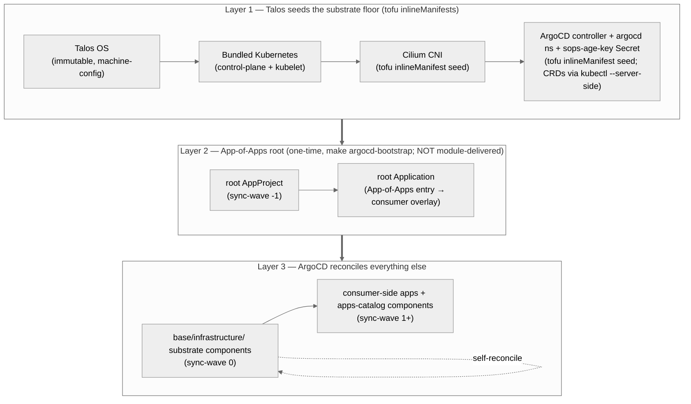

# Day-Zero Pattern — Three Layers from Bare Metal to ArgoCD-Reconciled

**Audience:** consumer-cluster operators, contributors, agentic tools.
**Companion docs:** [tutorial](tutorial-first-consumer-cluster.md) ·
[`ARCHITECTURE.md`](../ARCHITECTURE.md) ·
[`component-dependencies.md`](component-dependencies.md).

This explains *how* a consumer cluster goes from "bare nodes" to
"every component reconciled by ArgoCD", and *why* the path has three
distinct layers. The same path is recapped as commands in the
[*Where to go next*](tutorial-first-consumer-cluster.md#where-to-go-next)
section of the tutorial.

## The design intent in one sentence

> `talos-platform-base` provisions **Talos plus its substrate floor —
> Cilium (CNI) and ArgoCD** — through the `tofu/modules/talos-cluster`
> module, so that everything above the substrate can be reconciled by
> ArgoCD.

That sentence is the load-bearing invariant. The substrate pillars
(Talos + Cilium + ArgoCD) are seeded by the OpenTofu module at bootstrap
as Talos `inlineManifests`; every other artifact in this repo sits in
exactly one of the three layers below, and the layer dictates whether it
may be `kubectl apply`-ed directly or must be reconciled by ArgoCD.

## The three layers



Each layer has a distinct **lifecycle owner** and a distinct **change
mechanism**:

| Layer | Lifecycle owner | Change mechanism | Reconciliation |
|---|---|---|---|
| 1 — Talos + bundled K8s + CNI | Talos / Sidero Labs | `talosctl apply-config` + `talosctl upgrade-k8s` | none in-cluster |
| 2 — App-of-Apps root (NOT module-delivered) | this repo's `Makefile` | `make argocd-bootstrap` (one-time) | none until Layer 3 |
| 3 — everything else | this repo's `kubernetes/base/infrastructure/` + consumer overlay | git commit + push | ArgoCD continuous reconciliation |

## Layer 1 — what Talos delivers

Talos ships an immutable Linux node image with a bundled Kubernetes
control plane. Two artifacts in this repo participate in Layer 1:

1. **Talos machine-config patches** (the consumer's `tofu/modules/talos-cluster`
   call — `config_patches` plus per-node `config_patches`, including the ones
   the module composes from each node's `image` + `hardware_capabilities`). These
   define kubelet args, kernel cmdline, install disk, and similar host-level
   inputs. They never touch Kubernetes resources directly.

2. **Cilium CNI seed** (delivered by the `tofu/modules/talos-cluster`
   call). When `deploy_cilium = true` (the default) the module renders the
   Cilium chart locally with `data.helm_template` and bakes it into the
   controlplane `cluster.inlineManifests` as a create-only bootstrap **seed**
   — the same `data.helm_template` → inlineManifest pattern as the ArgoCD
   seed. It also injects `cluster.network.cni.name: none` +
   `cluster.proxy.disabled: true`, so the Talos-default Flannel and kube-proxy
   never come up. The module's `helm/cilium-values.yaml` is the floor;
   per-cluster install-time config rides the typed `cilium_*` inputs +
   `cilium_values_override`. Talos applies the seed at K8s-bootstrap time —
   **not** via ArgoCD. The reason is causal: without a CNI no pod can start,
   including ArgoCD's own pods. (`kubernetes/bootstrap/cilium/{values,extras}.yaml`
   are retained as the reference for optional Day-2 Cilium self-management; the
   former `cluster.extraManifests`-URL render path —
   `scripts/render-cilium-bootstrap.sh` — is retired.)

Cilium is **deliberately not present** in
`kubernetes/base/infrastructure/`. Looking for it there is a category
error; it lives in `bootstrap/` precisely because it must exist
before ArgoCD can run.

## Layer 2 — the App-of-Apps root (still required; NOT module-delivered)

ArgoCD the *controller* is a **Layer-1 substrate seed**: the
`tofu/modules/talos-cluster` module renders the argo-cd chart locally
and bakes it — together with the `argocd` namespace and the
`sops-age-key` Secret — into the controlplane `cluster.inlineManifests`
(`deploy_argocd = true`, the default); the ArgoCD CRDs are applied
server-side by the module's `kubectl --server-side` step, gated on the
cluster health check. So ArgoCD comes up *with the bootstrap*, the same
way Cilium does.

What the module does **not** deliver is the **App-of-Apps root** — the
consumer-identity `root` AppProject + `root` Application that point
ArgoCD at *this consumer's* git repo and overlay. They are parameterized
by the consumer's `repo.url` / `overlay` (see
`kubernetes/bootstrap/argocd/*.tmpl`) and therefore cannot live in the
cluster-agnostic module. Seeding them is the **one** remaining bootstrap
step, and it is **mandatory**: without it ArgoCD runs but reconciles
nothing — a healthy-looking, functionally inert cluster.

The bootstrap break of GitOps purity is therefore contained to exactly
**two** `kubectl apply` invocations, both behind `make argocd-bootstrap`
and both documented as exceptions in [`AGENTS.md`](../AGENTS.md)
§"Hard Constraints":

```bash
# make argocd-bootstrap — requires deploy_argocd=true AND a completed `tofu apply`
# (which seeds ArgoCD + applies its CRDs). It first waits out the cross-context
# ordering barrier: BOTH root CRDs (Application + AppProject), polling for
# existence so a not-yet-created CRD does not fail-fast, then the server:
for crd in applications.argoproj.io appprojects.argoproj.io; do
  until kubectl get crd "$crd" >/dev/null 2>&1; do sleep 2; done
  kubectl wait --for=condition=established "crd/$crd" --timeout=120s
done
kubectl wait --for=condition=available -n argocd deployment/argocd-server --timeout=300s
# then applies the App-of-Apps root (the only consumer-identity bootstrap state):
kubectl apply -f kubernetes/bootstrap/argocd/_out/root-project.yaml
kubectl apply -f kubernetes/bootstrap/argocd/_out/root-application.yaml
```

The waits matter: the `Application` and `AppProject` kinds require their
respective ArgoCD CRDs (`applications.argoproj.io`,
`appprojects.argoproj.io`), which `tofu apply` installs in a **different
execution context** than `make argocd-bootstrap`. The target polls each
CRD for existence *before* waiting on its `established` condition, so a
bootstrap launched before `tofu apply` finished — or in a split-CI
topology where the two run on separate runners — **blocks** rather than
failing fast on `no matches for kind "Application"`. If `tofu apply`
never ran its CRD step at all (the poll keeps timing out), re-apply the
CRDs with `tofu apply -replace=null_resource.argocd_crds[0]` (the
`manifest_sha` trigger makes a plain re-apply a no-op when the render is
unchanged).

Each exception has a documented reason:

- **`root-project` AppProject** — defines the RBAC boundary inside
  which the root Application is allowed to operate; sync-wave `-1`.
- **`root-application` Application** — the App-of-Apps entry that
  causes ArgoCD to discover and reconcile every other `Application`
  defined under `kubernetes/overlays/<env>/`.

The `argocd` namespace, the `sops-age-key` Secret, and the ArgoCD
controller are **Layer 1** now (module-seeded inlineManifests, no
consumer `kubectl apply`):

- **`argocd` namespace** — the module seed carries its PSA floor
  (`enforce: baseline`) + the recommended labels; steady-state label
  ownership transfers to the argocd Application via SSA-merge (the PSA
  floor is identical on both sides, so the transfer carries no PSA gap).
- **`sops-age-key` Secret** — ArgoCD needs the age private key to
  decrypt SOPS-encrypted secrets shipped via git; the key itself cannot
  be SOPS-encrypted (chicken-and-egg). It is sourced from
  `TF_VAR_sops_age_key` at `tofu apply` and lands in the controlplane
  machine-config, so the OpenTofu **state backend MUST be encrypted at
  rest** and key rotation is a `tofu apply` (re-seed), not a `kubectl`
  secret edit. The Secret is **only** the age key, never app secrets.

After `make argocd-bootstrap` succeeds, the boundary moves: any further
`kubectl apply` to ArgoCD-managed resources is now a hard constraint
violation, enforced by `AGENTS.md` and the `hard-constraints-check` CI
job in consumer repos.

## Layer 3 — ArgoCD-reconciled day-two

The root Application materializes the App-of-Apps: it points at
`kubernetes/overlays/<env>/` in the consumer cluster repo, which in
turn references the vendored base (`vendor/base/`) plus consumer-
specific overlays. ArgoCD discovers child Applications and reconciles
them by sync-wave:

```text
-1  Additional AppProjects         (per-tool RBAC boundaries)
 0  Infrastructure components      (the substrate set in base/infrastructure/)
 1  Apps (workload-layer + apps-catalog components)
```

ArgoCD itself is in sync-wave 0 — `kubernetes/base/infrastructure/argocd/`
contains the full reconciled definition. The Layer-1 inlineManifest
seed is converged onto by this Application; mid-version drift between
the create-only seed and the Application is corrected on the next
reconciliation loop.

This is the **only** "kubectl apply boundary" in the repo:

```text
Layer 1 (Talos):         talosctl apply-config
                         ─────────────────────────
Layer 2 (one-time seed): kubectl apply (2 invocations: root project + app)
                         ─────────────────────────
Layer 3 (day-two):       git push → ArgoCD reconciles  ← from here, NEVER kubectl apply
```

## The documented exceptions, summarized

`AGENTS.md` §"Hard Constraints" expresses the boundary as:

> NEVER `kubectl apply` ArgoCD-managed resources — commit to git, push,
> let ArgoCD sync; only exception: one-time bootstrap AppProjects
> (`kubernetes/bootstrap/`).

Concretely, "bootstrap exception" means the two App-of-Apps root
invocations of Layer 2 above. The Layer-1 Cilium and ArgoCD substrate is
delivered by the OpenTofu module as Talos `inlineManifests` — not by a
consumer `kubectl apply`. The ArgoCD **app** comes up from the
inlineManifest seed at boot; its **CRDs** — too large for an
inlineManifest — are applied by the module via `kubectl --server-side`
(gated on the health check), which also converges the app render.
**Nothing else** in this repo should ever appear in a `kubectl apply`
command.

## End-to-end command sequence (consumer-side reference)

This is the canonical day-zero recipe a consumer cluster operator
runs. The base repo itself is not directly invoked here — the consumer
repo has vendored it (`vendor/base/`) and runs the targets in the
context of its own cluster.

```bash
# Layer 1 — Talos (OpenTofu cluster-lifecycle module; run from the consumer's
# OpenTofu root that calls tofu/modules/talos-cluster — see the module README)
tofu init                                            # provider + ENCRYPTED state backend (holds the sops-age master key)
export TF_VAR_sops_age_key="$(cat $SOPS_AGE_KEY_FILE)" # seeded into the argocd sops-age-key inlineManifest
tofu apply                                           # PKI, installer, config apply, etcd bootstrap + Cilium & ArgoCD seeds + ArgoCD CRDs
tofu output -raw kubeconfig   > kubeconfig           # admin kubeconfig
tofu output -raw talosconfig  > talosconfig          # talosctl client config

# Layer 2 — App-of-Apps root (one-time; ArgoCD itself is already up from Layer 1)
make argocd-bootstrap ENV=cluster.yaml               # waits for ArgoCD CRDs+server, then seeds the root project + app
make argocd-password                                 # initial admin password (rotate after first login)

# Layer 3 — wait, then git push
kubectl -n argocd get applications --watch           # ArgoCD reconciles the base substrate components
# from this moment on, every change goes via:
#   git commit && git push  →  ArgoCD detects  →  ArgoCD syncs
```

## Where this pattern is incomplete today

The pattern is structurally complete and verified across the base
substrate components — none of them violate the Layer-3-only rule. One
surface remains unevenly polished:

- **CNI choice is not swappable yet.** The substrate-layer "Talos +
  bundled K8s + CNI" is true today, but Cilium-specific coupling in the
  bootstrap seed means the *CNI choice* is currently not swappable
  without a multi-day rewrite. See
  [issue #59](https://github.com/Nosmoht/talos-platform-base/issues/59)
  for the decoupling track.

## See also

- [`tutorial-first-consumer-cluster.md`](tutorial-first-consumer-cluster.md) — the rendering-only walk-through that stops short of Layer 2
- [`ARCHITECTURE.md`](../ARCHITECTURE.md) §"Sync-wave order" — the canonical wave-number list
- [`component-dependencies.md`](component-dependencies.md) — the graph of how the Layer-3 components depend on each other
- [`AGENTS.md`](../AGENTS.md) §"Hard Constraints" — the `NEVER kubectl apply` rule with the documented exception
- [`rendered-manifests.md`](rendered-manifests.md) — the three-stage render pipeline that produces the Cilium bootstrap manifest and the component manifests
