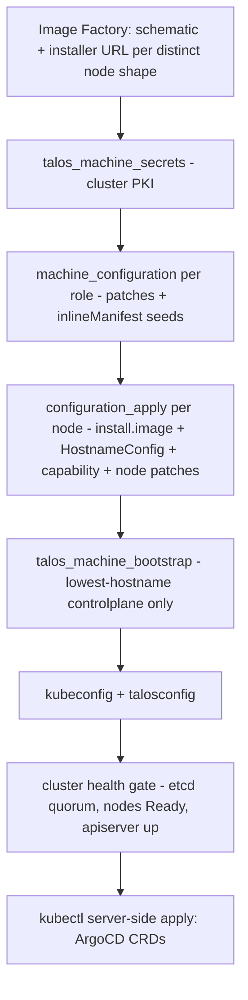

# Day-Zero Bootstrap

Day zero turns PXE-booted Talos maintenance-mode nodes into a bootstrapped,
GitOps-managed Kubernetes cluster in two acts: a single `tofu apply` of the
`tofu/modules/talos-cluster` module (which seeds the whole substrate), then
`task bootstrap:argocd` (which seeds the consumer-identity App-of-Apps root).
Hardware provisioning and PXE boot are out of scope for the base.

## What the module seeds via controlplane inlineManifests

Talos `cluster.inlineManifests` are **create-only seeds**: Talos re-applies
them on every machine-config apply and **creates** any not-yet-existing
manifest, but never **updates or deletes** a resource it already created
("create-only" means an *existing* object is inert to the seed). So a fresh
cluster gets every seed at bootstrap, a later `tofu apply` lands newly-added
manifests (this is what makes the renamed cert-approver reach an existing
cluster), and an in-place edit to an already-seeded resource does not
propagate — see [ADR-0013](../decisions/0013-kubelet-serving-cert-rotation.md)
and the upgrade guide (`UPGRADING.md`). The module bakes three seeds into the
controlplane machine config (workers carry none):

- **Cilium** (`deploy_cilium`, default `true`) — the `cilium` chart is
  rendered locally via `data.helm_template` (no `helm_release`, no live
  apply) from three value layers: the shipped floor
  (`tofu/modules/talos-cluster/helm/cilium-values.yaml`), module-computed
  values from typed inputs (routing mode, kube-proxy replacement with
  KubePrism `localhost:7445`, native-routing CIDRs, dual-stack, MTU, Gateway
  API, encryption), and an optional consumer `cilium_values_override`. When
  `cilium_encryption.type = "ipsec"`, a `cilium-ipsec-keys` Secret is seeded
  first. An authoritative companion patch sets `cluster.network.cni.name:
  none` (and `proxy.disabled` with kube-proxy replacement) *last* in the
  patch order, so no caller patch can resurrect Flannel — the documented
  opt-out is `deploy_cilium = false`.
- **ArgoCD** (`deploy_argocd`, default `true`) — three inlineManifest entries
  in apply order: the `argocd` Namespace (six recommended labels + a
  PSA-`baseline` floor), the `sops-age-key` Secret (the ksops repoServer
  decrypts SOPS manifests with it; a plan-time precondition requires the key
  to start with `AGE-SECRET-KEY-1`), and the chart render from
  `tofu/modules/talos-cluster/helm/argocd-values.yaml` plus an optional
  `argocd_values_override`. The render deliberately excludes CRDs
  (`include_crds = false`) — see the CRD side-channel below.
- **cert-approver** — unconditional (no disable toggle): the
  `kubelet-csr-approver` Namespace (PSA-`restricted`) plus the
  **postfinance/kubelet-csr-approver** manifest
  (`tofu/modules/talos-cluster/manifests/kubelet-csr-approver.yaml`). The
  manifest is the postfinance Helm chart rendered at pin time and committed,
  then `templatefile()`-parameterized with the three per-cluster
  `substrate.cert_approver` knobs — `provider_regex` / `provider_ip_prefixes`
  (SAN allowlists) and `replicas` (`> 1` derives leader-election + leases RBAC).
  Because `templatefile()` is pure, this seed stays outside the
  `data.helm_template` freeze pattern Cilium and ArgoCD use. It pairs with the
  all-nodes kubelet patch `serverTLSBootstrap: true`; the cluster-scoped approver
  approves serving CSRs from workers too and enforces a per-node DNS-SAN binding
  default-on. Decisions:
  [0013-kubelet-serving-cert-rotation](../decisions/0013-kubelet-serving-cert-rotation.md)
  (rotation default-on + seed model) and
  [0019-postfinance-kubelet-csr-approver](../decisions/0019-postfinance-kubelet-csr-approver.md)
  (the postfinance approver + config surface, superseding 0013 §D2).

Two supporting mechanics:

- **Frozen renders** — each helm render is captured once in a
  `terraform_data` resource with `ignore_changes`, because the helm provider
  does not render byte-stable manifests and a live render would churn the
  machine config on every plan. Plan-time postconditions refuse to freeze an
  empty render (which would otherwise bootstrap a CNI-less or ArgoCD-less
  cluster and never self-heal). Deliberate re-seed requires `-replace`.
  Consequence: `cilium_chart_version` / `argocd_chart_version` are **seed
  knobs, not upgrade knobs**.
- **Optional Gateway API CRD boot-seed** — when `cilium_gateway_api_crds_url`
  is set, the CRDs are fetched at boot via `cluster.extraManifests`. Default
  is empty: CRDs arrive via Day-1 GitOps from the apps catalog, which is
  air-gap-safe (a failed `extraManifests` fetch crashloops the Talos
  controller). The Cilium GatewayClass reconciles once CRDs exist, whatever
  their source.

## The bootstrap sequence

As implemented in `tofu/modules/talos-cluster/main.tf`:

Key properties:

- **PKI in state** — `talos_machine_secrets` generates the cluster PKI into
  OpenTofu state, so the caller must use an encrypted backend. Adopting an
  already-running cluster requires importing the existing secrets first.
- **Stable bootstrap target** — the bootstrap node is selected by lowest
  controlplane *hostname*, not list order, so reordering `nodes` cannot move
  which node was bootstrapped (multiple bootstraps would split-brain etcd).
- **Blocking health gate** — `tofu apply` does not return at the bootstrap
  call; a health data source polls until etcd quorum, node readiness, and
  apiserver reachability hold (timeout `cluster_health_timeout`).
- **Kubeconfig regenerates on an endpoint change** — `talos_cluster_kubeconfig.this`
  carries a `lifecycle.replace_triggered_by` keyed on a `terraform_data`
  marker tracking `var.cluster_endpoint` (`kubeconfig-refresh.tf`), so a
  later change to the advertised cluster endpoint — a VIP move, a DNS
  rename, or a control-plane node re-IP on a single-control-plane cluster
  where the endpoint is expressed as that node's own IP — forces a
  state-only destroy+recreate that re-fetches the kubeconfig instead of
  leaving it frozen at the bootstrap-time value. On a VIP/DNS endpoint a
  plain node re-IP is correctly inert. The recreate rotates the embedded
  admin client certificate; adding the marker to an already-bootstrapped
  cluster's state does not itself trigger a recreate (inert until the
  endpoint actually changes). The existing health gate polls the
  control-plane node IPs, not the advertised endpoint, so on a VIP/DNS
  endpoint it does not verify the new endpoint is reachable — the
  consumer confirms the endpoint is correct and propagated. A re-fetched
  kubeconfig is also only usable once the new hostname/IP is in the
  apiserver serving-cert SANs.
- **CRD side-channel** — the three ArgoCD CRDs render to roughly 1.8 MB, far
  beyond inlineManifest budget (the app render is about 109 KB), so after
  the health gate the module writes the kubeconfig plus the CRD documents to
  disk and runs `kubectl apply --server-side`. The payload is projected down
  to `CustomResourceDefinition` documents before the freeze and the apply
  carries no `--force-conflicts`, so it delivers the CRDs and touches nothing
  else — see [0025-argocd-crd-apply-scope](../decisions/0025-argocd-crd-apply-scope.md)
  for what the former full-render, force-applying form did. It re-runs on an
  intended chart/version bump; every apply host must ship `kubectl`.
  Rationale: [0006-opentofu-cluster-lifecycle](../decisions/0006-opentofu-cluster-lifecycle.md).

## Seeding the App-of-Apps root: `task bootstrap:argocd`

The module delivers ArgoCD itself, but *not* the consumer-identity root —
that is `task bootstrap:argocd` (preconditions: `deploy_argocd = true` and a
completed `tofu apply`). It reads **only the bootstrap-identity subset** of
`cluster.yaml` ([cluster-yaml](../reference/cluster-yaml.md)):
`.cluster.name`, `.cluster.overlay`, `.cluster.target_revision`
(default `main`), and `.repo.url` — values containing `$` are rejected as
unsafe for `envsubst`.

It then renders the two templates under `kubernetes/bootstrap/argocd/` into
a local `_out/` directory:

- `root-project.yaml.tmpl` → AppProject **`root-bootstrap`**: source repos
  limited to the consumer repo URL, destination limited to the `argocd`
  namespace, cluster-resource whitelist of `Namespace` only, and a
  namespace-resource whitelist of `AppProject` + `Application`. This is the
  minimal RBAC scope the root needs to fan out.
- `root-application.yaml.tmpl` → Application **`root`** in project
  `root-bootstrap`, pointing at `kubernetes/overlays/<overlay>` of the
  consumer repo at `<target_revision>`, with automated sync
  (`prune: true`, `selfHeal: true`), retry backoff, `CreateNamespace=true`
  and `ServerSideApply=true`.

Before applying, the task restores the cross-context ordering barrier: it
waits for the `applications.argoproj.io` and `appprojects.argoproj.io` CRDs
to exist and become Established, and for the `argocd-server` Deployment to be
Available (a persistent CRD NotFound means the module's CRD step did not
finish — recover with `tofu apply -replace=null_resource.argocd_crds[0]`).
Then it applies the project *before* the application — at bootstrap the
project/app ordering is this apply sequence. In steady-state overlays the
equivalent ordering is the sync-wave convention (`-1` AppProjects → `0`
infrastructure → `1` apps). `task bootstrap:argocd-password` prints the
initial admin password (rotate after first login).

## The direct-apply exception

The standing rule is: **never `kubectl apply` ArgoCD-managed resources** —
commit to git and let ArgoCD reconcile. The one documented exception is
one-time bootstrap content under `kubernetes/bootstrap/` (exactly what
`task bootstrap:argocd` applies). The module's server-side CRD apply is
tofu-executed, not an operator workflow, and stays inside that spirit: it
delivers only what the seed cannot carry.

That scope is now literal. The apply used to cover the chart's **full**
default render — the data source behind it carries no values block — and used
`--force-conflicts`, so on every re-fire (its trigger set includes
`kubernetes_version`, i.e. a routine Kubernetes upgrade) it pushed
chart-default workloads and ConfigMaps over ArgoCD's own state and took
field-manager ownership of `argocd-cm` and `argocd-rbac-cm`. Since
[adr-0025](../decisions/0025-argocd-crd-apply-scope.md) the render is projected
down to `CustomResourceDefinition` documents before the freeze and applied
without the force flag: the module delivers CRDs, and convergence of the app
itself is ArgoCD self-management's job. Existing clusters are not repaired
retroactively — `kubectl` stays a recorded field manager on what it already
touched; the change stops future applies from re-taking it.

## Handoff to steady state

Once the `root` Application syncs, GitOps owns the cluster: the consumer
overlay fans out AppProjects and Applications, and ArgoCD transitions to
self-management through the base's one kustomize component
(`kubernetes/substrate/argocd/`, rendered manifests committed —
see [manifest-pipeline](../reference/manifest-pipeline.md)).

ArgoCD therefore ships through **two render paths** — the slim Day-0 seed
values (`tofu/modules/talos-cluster/helm/argocd-values.yaml`) and the
steady-state values (`kubernetes/substrate/argocd/values.yaml`).
Shared invariants must hold in both so they cannot drift silently, gated by
`scripts/check-argocd-substrate-invariants.sh` (run in `task gitops:validate`
and CI):

- **I1** — neither render produces a bundled-Dex resource (no document
  labelled `app.kubernetes.io/component: dex-server`, none named
  `argocd-dex-server`): SSO is wired against an external OIDC provider by
  patching the `oidc.config` key of the `argocd-cm` ConfigMap in the consumer's
  own overlay, and an idle Dex would also bloat the inlineManifest seed.
- **I2** — no rendered ConfigMap carries a `.data` key prefixed
  `server.dex.server` (scanning every ConfigMap is rename-proof; the
  legitimate `configMapKeyRef` *consumers* of those keys are not violations).
- **I3** (shared across both render paths) — the rendered `argocd-cm` carries no
  `url` key. ArgoCD documents `url` as required for SSO and derives the OIDC
  redirect URI from it, so the chart's placeholder hostname fails at the IdP
  rather than in the cluster; an absent key is the visible state, and the
  consumer supplies the real value. `argocd-notifications-cm`'s `argocdUrl` is
  an accepted residual — Helm's `default` treats `""` as unset, so it cannot be
  cleared without disabling the whole notifications workload.
- **I4** (steady-state render only) — `argocd-rbac-cm` carries no non-empty
  `policy.csv`: the substrate ships no identity, and the seed values have never
  carried one. Steady-state-only because the published component is what a
  consumer's overlay merges onto, so a principal shipped there would become a
  standing grant in every consuming cluster
  ([argocd-sso-contract](../reference/argocd-sso-contract.md)).

Both paths render from the same chart tarball, pinned and sha256-verified
against `kubernetes/substrate/argocd/chart.lock.yaml`. Consumer
`values_override` content is out of base scope (consumer-cluster policy owns
it). Day-2 boundaries follow from the seed semantics: ArgoCD upgrades itself
via GitOps, Kubernetes upgrades run out-of-band via `talosctl upgrade-k8s`,
and OS upgrades flow through `talos_install_version` plus an out-of-band
`talosctl upgrade` per node (the schema-pin/install-pin split is worked
through in `tofu/modules/talos-cluster/README.md`).
